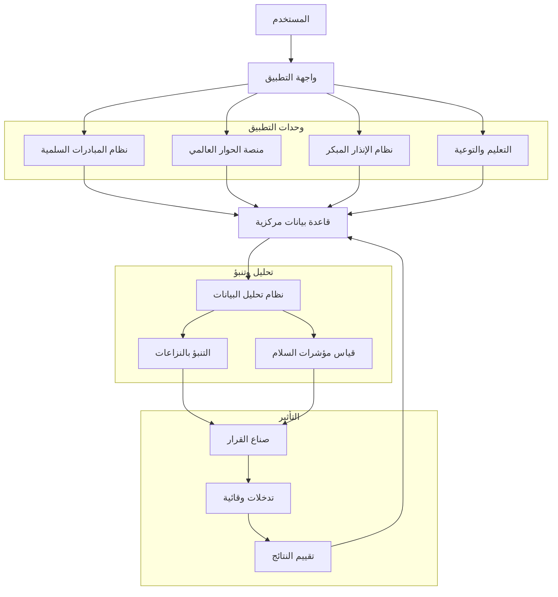

```mermaid
flowchart TD
    A[المستخدم] --> B[واجهة التطبيق]
    
    B --> C[نظام المبادرات السلمية]
    B --> D[منصة الحوار العالمي]
    B --> E[نظام الإنذار المبكر]
    B --> F[التعليم والتوعية]
    
    C --> G[قاعدة بيانات مركزية]
    D --> G
    E --> G
    F --> G
    
    G --> H[نظام تحليل البيانات]
    H --> I[التنبؤ بالنزاعات]
    H --> J[قياس مؤشرات السلام]
    
    I --> K[صناع القرار]
    J --> K
    
    K --> L[تدخلات وقائية]
    L --> M[تقييم النتائج]
    M --> G

    subgraph وحدات التطبيق
        C
        D
        E
        F
    end

    subgraph تحليل وتنبؤ
        H
        I
        J
    end

    subgraph التأثير
        K
        L
        M
    end
```
