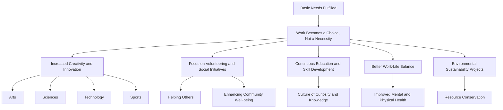

```mermaid

graph TD;
    A[Basic Needs Fulfilled] --> B[Work Becomes a Choice, Not a Necessity]
    B --> C[Increased Creativity and Innovation]
    B --> D[Focus on Volunteering and Social Initiatives]
    B --> E[Continuous Education and Skill Development]
    B --> F[Better Work-Life Balance]
    B --> G[Environmental Sustainability Projects]

    C --> H[Arts]
    C --> I[Sciences]
    C --> J[Technology]
    C --> K[Sports]

    D --> L[Helping Others]
    D --> M[Enhancing Community Well-being]

    E --> N[Culture of Curiosity and Knowledge]

    F --> O[Improved Mental and Physical Health]

    G --> P[Resource Conservation]

```
